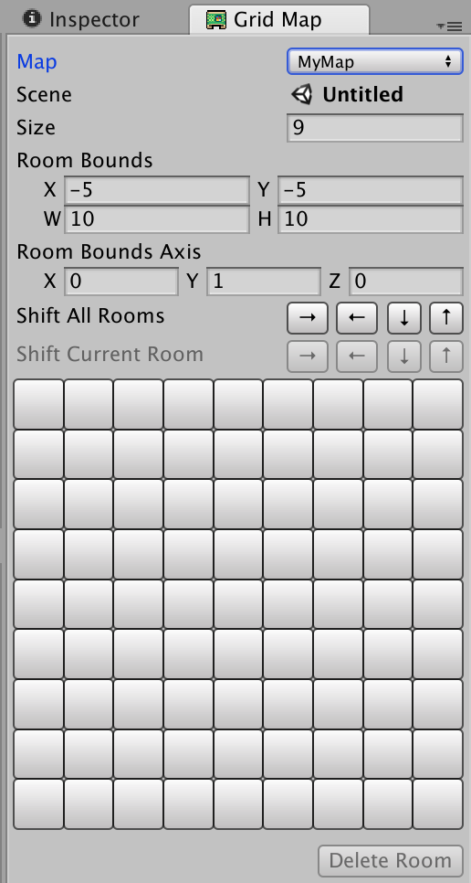
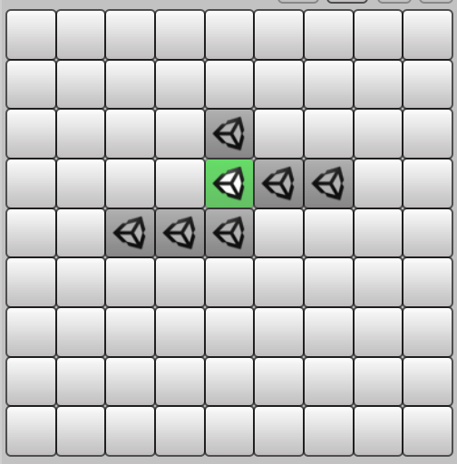
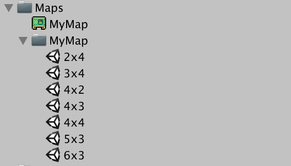
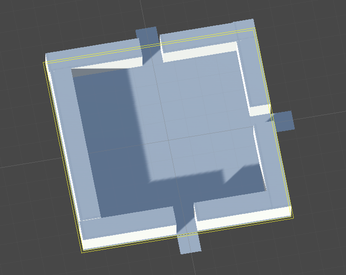

# **GridMap**
A simple Unity tool for organizing scenes into grids. It is very basic, and merely helps you keep track of rooms as if they were on a larger map.

### **Creating a map**
First, you need to create a map which which be used to create and track your rooms.

> **Assets ➞ Create ➞ Grid Map**

Once you've created and named your map, open up the `Grid Map` window.

> **Window ➞ Grid Map**

Here, you are displayed a grid, which represents a bunch of rooms adjacent to each other.

By clicking on a button, you will open that room. If a scene doesn't exist for that room, one will be created.

These are created in a folder with the same name as the map, and are named based on their position on the grid.

This allows you to easily click around on the map to open up different rooms based on position (rather than having to remember them by name).

The `Room Bounds` also is a helpful visualization if you want to make sure your rooms have a uniform size. If you want to turn if off or change its color, you can do so by going to:

> **Unity ➞ Preferences ➞ Grid Map**

### **Note**

The rooms are named based on their position, so if you use the shifting buttons to reposition the rooms, they will be renamed, so be cautious.

Also, if you want to reposition a room, another way to do it is merely to change its name. For example I could rename room `4x4` to `2x2` and the grid map will update and put it in the new position.
